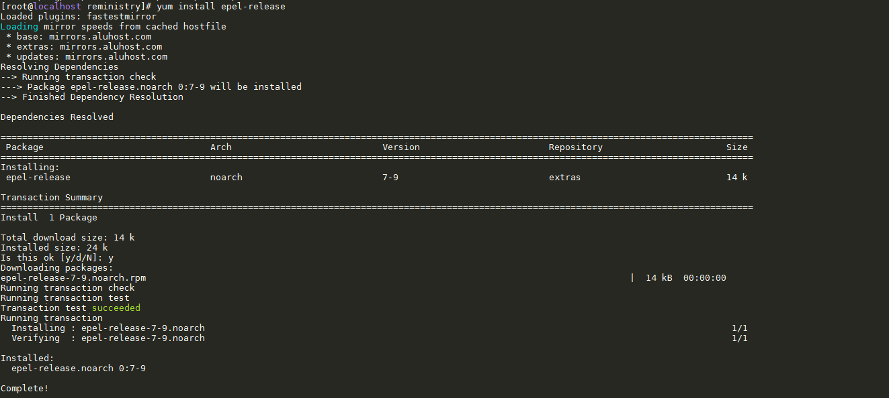
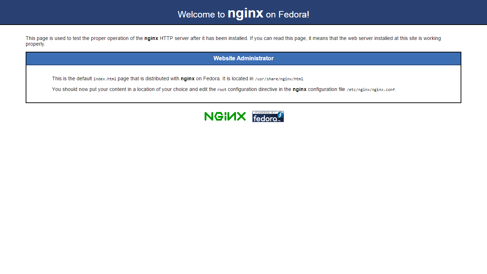
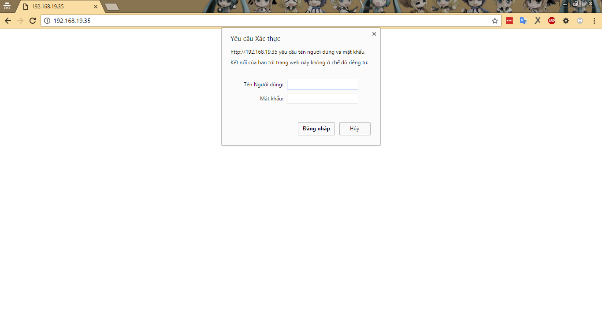

# Cài đặt nginx server trên CentOS 7

# Mục lục

- [Cài đặt nginx](#install)
- [Các cấu hình nginx cơ bản](#config-basic)
- [Cấu hình giới hạn quyền truy cập](#allow)
- [Các nội dung khác](#content-others)

# Nội dung

- ##### <a name="install">Cài đặt nginx</a>

	+ Để tiến hành cài đặt *nginx* trên hệ điều hành CentOS, bước đầu tiên cần làm đó là phải thêm EPEL reponsitory để có thể cài đặt *nginx* sử dụng câu lệnh bằng việc chạy câu lệnh sau:

			# yum install epel-release
		> 
	
	+ Sau khi hoàn thành chạy câu lệnh trên, ta tiến hành cài đặt *nginx* sử dụng câu lệnh:

			# yum install nginx

	+ Bước 2: Thực hiện cấu hình firewall cho phép enable cổng 80 và chạy dịch vụ http. Sử dụng câu lệnh:

			# firewall-cmd --add-service=http --permanent
			# firewall-cmd --reload

	+ Bước 3: Thực hiện kiểm tra việc cài đặt *nginx* đã thành công hay chưa bằng việc mở trình duyệt lên và đi tới địa chỉ url: http://your_ip, kết quả nếu như cài đặt thành công sẽ thấy được như hình dưới:
		
		> 

- ##### <a name="config-basic">Các cấu hình nginx cơ bản</a>

	+ Thông thường, các cấu hình dành cho *nginx* được chứa trong cây thư mục */etc/nginx/conf.d/* và */etc/nginx/default.d/* với nội dung trong các file có phần mở rộng là *.conf* và trong file */etc/nginx/nginx.conf*.

	+ Dưới đây là nội dung của một file cấu hình chính */etc/nginx/nginx.conf* được mô tả như sau:

			# For more information on configuration, see:
			#   * Official English Documentation: http://nginx.org/en/docs/
			#   * Official Russian Documentation: http://nginx.org/ru/docs/

			user nginx;
			worker_processes auto;
			error_log /var/log/nginx/error.log;
			pid /run/nginx.pid;

			# Load dynamic modules. See /usr/share/nginx/README.dynamic.
			include /usr/share/nginx/modules/*.conf;

			events {
			    worker_connections 1024;
			}

			http {
			    log_format  main  '$remote_addr - $remote_user [$time_local] "$request" '
			                      '$status $body_bytes_sent "$http_referer" '
			                      '"$http_user_agent" "$http_x_forwarded_for"';

			    access_log  /var/log/nginx/access.log  main;

			    sendfile            on;
			    tcp_nopush          on;
			    tcp_nodelay         on;
			    keepalive_timeout   65;
			    types_hash_max_size 2048;

			    include             /etc/nginx/mime.types;
			    default_type        application/octet-stream;

			    # Load modular configuration files from the /etc/nginx/conf.d directory.
			    # See http://nginx.org/en/docs/ngx_core_module.html#include
			    # for more information.
			    include /etc/nginx/conf.d/*.conf;

			    server {
			        listen       80 default_server;
			        listen       [::]:80 default_server;
			        server_name  _;
			        root         /usr/share/nginx/html;

			        # Load configuration files for the default server block.
			        include /etc/nginx/default.d/*.conf;

			        location / {
			        }

			        error_page 404 /404.html;
			            location = /40x.html {
			        }

			        error_page 500 502 503 504 /50x.html;
			            location = /50x.html {
			        }
			    }

			# Settings for a TLS enabled server.
			#
			#    server {
			#        listen       443 ssl http2 default_server;
			#        listen       [::]:443 ssl http2 default_server;
			#        server_name  _;
			#        root         /usr/share/nginx/html;
			#
			#        ssl_certificate "/etc/pki/nginx/server.crt";
			#        ssl_certificate_key "/etc/pki/nginx/private/server.key";
			#        ssl_session_cache shared:SSL:1m;
			#        ssl_session_timeout  10m;
			#        ssl_ciphers HIGH:!aNULL:!MD5;
			#        ssl_prefer_server_ciphers on;
			#
			#        # Load configuration files for the default server block.
			#        include /etc/nginx/default.d/*.conf;
			#
			#        location / {
			#        }
			#
			#        error_page 404 /404.html;
			#            location = /40x.html {
			#        }
			#
			#        error_page 500 502 503 504 /50x.html;
			#            location = /50x.html {
			#        }
			#    }

			}

	- Để tạo ra một cấu hình xác thực cơ bản để ngăn không cho truy cập trái phép vào một đường link nào đó trên web server. Ta tiến hành sửa file */etc/nginx/nginx.conf* với việc thêm nội dung sau vào trong nội dung của từ khóa *location /* trong cụm cấu hình cho *server*:

			*auth_basic            "Basic Auth";*
            *auth_basic_user_file  "/etc/nginx/.htpasswd";*

    - Nội dung file sau  khi sửa có nội dung tương tự như sau:

			# For more information on configuration, see:
			#   * Official English Documentation: http://nginx.org/en/docs/
			#   * Official Russian Documentation: http://nginx.org/ru/docs/

			user nginx;
			worker_processes auto;
			error_log /var/log/nginx/error.log;
			pid /run/nginx.pid;

			# Load dynamic modules. See /usr/share/nginx/README.dynamic.
			include /usr/share/nginx/modules/*.conf;

			events {
			    worker_connections 1024;
			}

			http {
			    log_format  main  '$remote_addr - $remote_user [$time_local] "$request" '
			                      '$status $body_bytes_sent "$http_referer" '
			                      '"$http_user_agent" "$http_x_forwarded_for"';

			    access_log  /var/log/nginx/access.log  main;

			    sendfile            on;
			    tcp_nopush          on;
			    tcp_nodelay         on;
			    keepalive_timeout   65;
			    types_hash_max_size 2048;

			    include             /etc/nginx/mime.types;
			    default_type        application/octet-stream;

			    # Load modular configuration files from the /etc/nginx/conf.d directory.
			    # See http://nginx.org/en/docs/ngx_core_module.html#include
			    # for more information.
			    include /etc/nginx/conf.d/*.conf;

			    server {
			        listen       80 default_server;
			        listen       [::]:80 default_server;
			        server_name  _;
			        root         /usr/share/nginx/html;

			        # Load configuration files for the default server block.
			        include /etc/nginx/default.d/*.conf;

			        location / {
			        	*auth_basic            "Basic Auth";*
			            *auth_basic_user_file  "/etc/nginx/.htpasswd";*
			        }

			        error_page 404 /404.html;
			            location = /40x.html {
			        }

			        error_page 500 502 503 504 /50x.html;
			            location = /50x.html {
			        }
			    }

			# Settings for a TLS enabled server.
			#
			#    server {
			#        listen       443 ssl http2 default_server;
			#        listen       [::]:443 ssl http2 default_server;
			#        server_name  _;
			#        root         /usr/share/nginx/html;
			#
			#        ssl_certificate "/etc/pki/nginx/server.crt";
			#        ssl_certificate_key "/etc/pki/nginx/private/server.key";
			#        ssl_session_cache shared:SSL:1m;
			#        ssl_session_timeout  10m;
			#        ssl_ciphers HIGH:!aNULL:!MD5;
			#        ssl_prefer_server_ciphers on;
			#
			#        # Load configuration files for the default server block.
			#        include /etc/nginx/default.d/*.conf;
			#
			#        location / {
			#        }
			#
			#        error_page 404 /404.html;
			#            location = /40x.html {
			#        }
			#
			#        error_page 500 502 503 504 /50x.html;
			#            location = /50x.html {
			#        }
			#    }

			}
	
	- Bước tiếp theo, tạo tài khoản để cấp phép truy cập bằng việc sử dụng câu lệnh sau:
			
			# yum insstall httpd-tools
			# htpasswd -c /etc/nginx/.htpasswd admin
			Re-type new password: 
			Adding password for user admin
			# service nginx restart

	- Cú pháp sử dụng câu lệnh htpasswd như sau:

			# htpasswd OPTION PASSWORDFILE USER PASSWORD

		với các options:

		- -c	Create the passwdfile. If passwdfile already exists, it is rewritten and truncated
		- -b	Use batch mode; i.e., get the password from the command line rather than prompting for it
		- -n	Display the results on standard output rather than updating a file
		- -m	Use MD5 encryption for passwords
		- -d	Use crypt() encryption for passwords (default)
		- -s	Use SHA encryption for passwords
		- -p	Use plaintext passwords
		- -D	Delete user

	- Kết quả sau khi chúng ta khởi động lại *nginx* và truy cập lại trang website vừa rồi (http://your_ip) trông như sau:

		> 
	
		Trong bước này, bạn cần phải nhập chính xác tên user và mật khẩu của user đó mới có quyền truy cập trang website.

	- Cấu hình giới hạn cho phép địa chỉ IP truy cập.

		+ Nếu như bạn muốn giới hạn truy cập, chỉ cho phép một địa chỉ ip hoặc một dải địa chỉ ip được phép truy cập vào web server còn lại tất cả các địa chỉ khác không được phép truy cập. Thì cần thêm nội dung sau vào file cấu hình của web server theo mẫu:

				Allow	ip[source_ip]| all;
				Deny	ip[source_ip]| all;

			Ví dụ:

					Allow	192.168.19.0/24;
					Deny	all;

		Với 2 dòng cấu hình trên server sẽ chi cho phép các địa chỉ ip thuộc dải 192.168.19.0/24 được truy cập tới website.

- # <a name="content-others">Các nội dung khác</a>
	
	- [ ] [Ý nghĩa của các dòng trong file cấu hình](../Configure/mean-configure.md)
	- [X] [Cấu hình tạo một virtual host](../Configure/create-virtual-host.md)
	- [ ] 
	- [ ] 
	- [ ] 
	- [ ] 
	- [ ] 
	- [ ] 
	- [ ] 
	- [ ] 
	- [ ] 