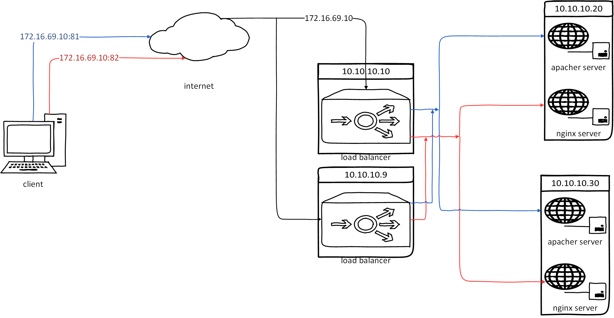
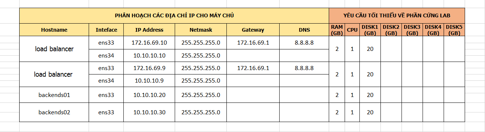

# Thực hiện bài lab Nginx Failover.

## I. Mô hình.

   > 

- IP Planning
    > 
        
## II. Cài đặt và cấu hình.

### 1. Cấu hình trên các node trong hệ thống

- Lần lượt cấu hình cho 2 load balancer giống nhau và các node server theo hướng dẫn [tại đây](nginx-multiple-upstream.md)

###  2. Cài đặt và cấu hình Keep alive

- Trên cả 2 node load balancing chúng ta thực hiện giống hệt nhau :

- Cài đặt các gói phần mềm hỗ trợ :

    ```sh
    yum install gcc kernel-headers kernel-devel -y
    ```

- Cài đặt keep alive :

    ```sh
    yum install keepalived
    ```

- Dùng trình soạn thảo `vi` mở file `/etc/keepalived/keepalived.conf` :

    ```sh
    vi /etc/keepalived/keepalived.conf
    ```

- Tìm và sửa lại các dòng sau :

    ```sh
    vrrp_instance VI_1 {
        state MASTER
        interface eth1
        virtual_router_id 51
        priority 101
        advert_int 1
        authentication {
            auth_type PASS
            auth_pass 1111
        }
        virtual_ipaddress {
            10.10.10.69
        }
    ```

- Khởi động dịch vụ :

    ```sh
    service keepalived start
    chkconfig keepalived on
    ```

- Kiểm tra lại địa chỉ :

    ```sh
    ip addr show eth1
    ```
