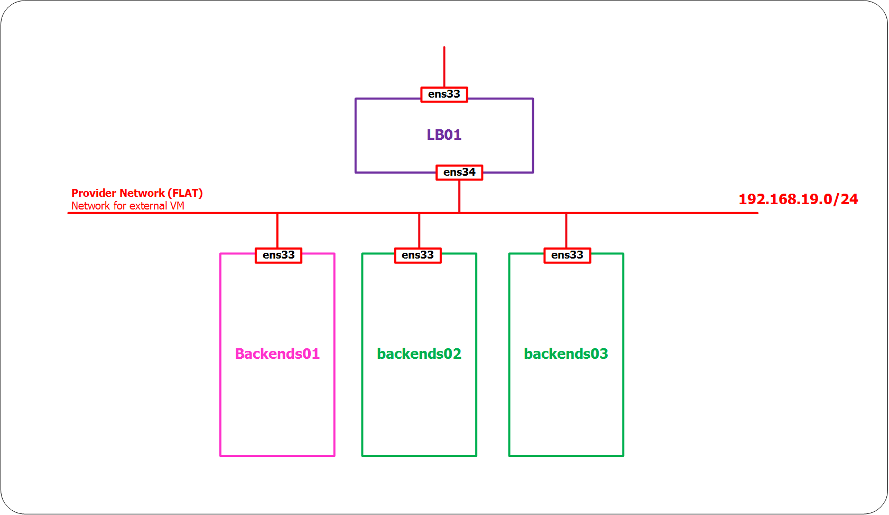
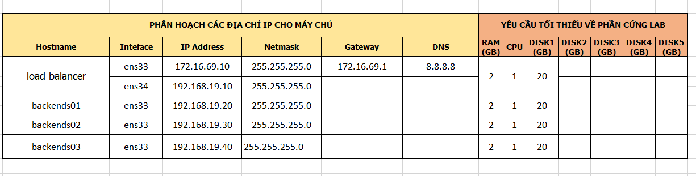
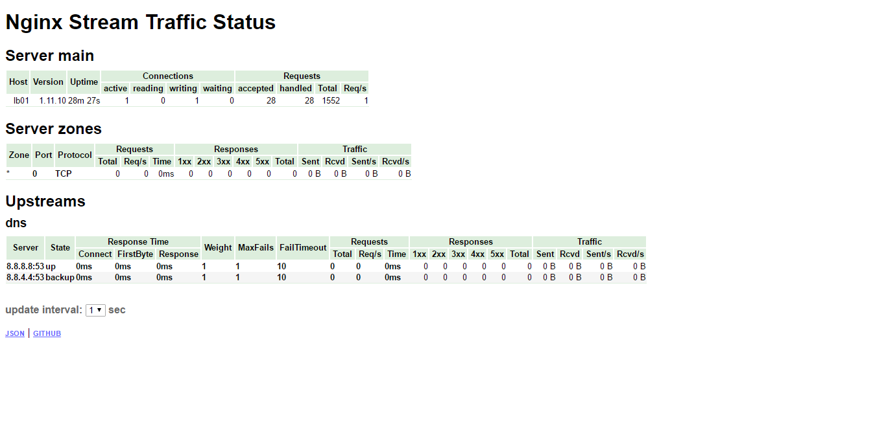
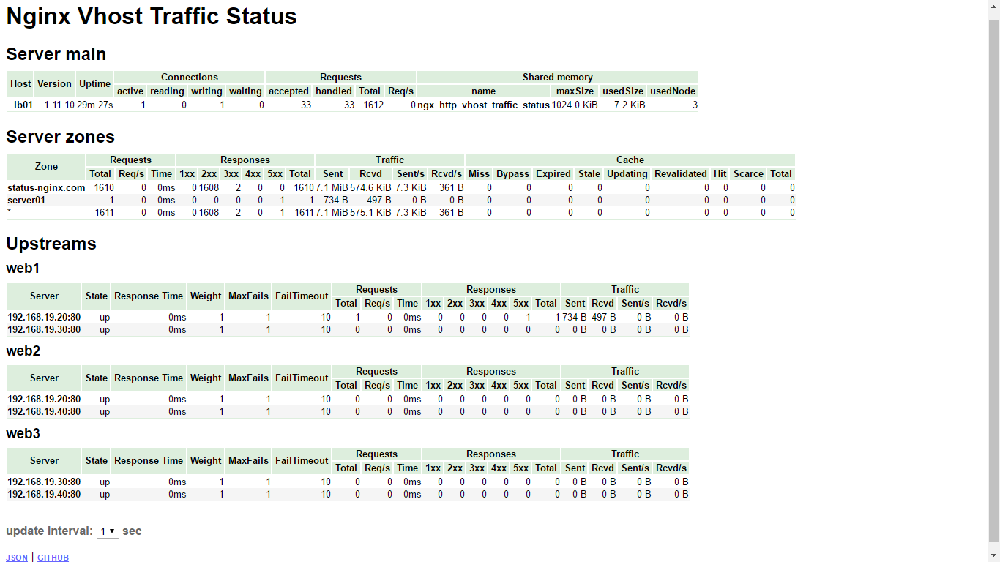

# Cài đặt nginx-vts-module (VirtualHost Traffic Status) và nginx-sts-module (Stream Traffic Status)

# Mục lục
- [Hướng dẫn cài đặt nginx-vts-module](#vts)
- [Hướng dẫn cài đặt nginx-sts-module](#sts)
- [Hướng dẫn cài đặt nginx](#nginx)
- [Các nội dung khác](#content-others)

# Nội dung

- #### Mô hình bài toán cài đặt:

	> 

- #### Kế hoạch đặt địa chỉ IP:

	> 
	

- #### <a name="vts">Hướng dẫn cài đặt nginx-vts-module</a>

	+ Đây là module cung cấp cho bạn trang quản lý lưu lượng truy cập các VirtualHost trong server nginx:

	+ Bước 1: Download source code của module nginx-vts-module:

			mkdir /home/$USER/downloads
			cd /home/$USER/downloads
			git clone https://github.com/vozlt/nginx-module-vts.git

- #### <a name="sts">Hướng dẫn cài đặt nginx-stream-sts-module</a>
	
	+ Đây là module cung cấp cho bạn trang quản lý lưu lượng truy cập tới các luồng điều khiển hướng truy cập tới server nginx:

	+ Bước 1: Download source code của nginx-sts-module:

			git clone https://github.com/vozlt/nginx-module-sts.git

	+ Bước 2: Download source code của nginx-stream-sts-module 2 module sts này phụ thuộc vào nhau:

			git clone https://github.com/vozlt/nginx-module-stream-sts.git

___

	# Lưu ý:

		Để cài đặt được 2 module trên cho nginx, 
		ta cần phải cài đặt nginx theo cách compile 
		từ source code của nginx
		Cách cài đặt nginx xem hướng dẫn ở phía dưới.

- #### <a name="nginx">Hướng dẫn cài đặt nginx</a>

	+ Bước 1: Cài các trình biên dịch để thực hiện cài nginx từ source code.

			yum -y install gcc gcc-c++ make zlib-devel pcre-devel \
			openssl-devel git wget geoip-devel epel-release

	+ Bước 2: Download source code nginx

			wget http://nginx.org/download/nginx-1.13.0.tar.gz
			tar -zxf nginx-1.13.0.tar.gz
			cd nginx-1.13.0

	+ Bước 3: Thực hiện cài đặt nginx cùng với 2 module trên:
	
			./configure --user=nginx --group=nginx \
			--add-module=/home/$USER/downloads/nginx-module-sts/ \
			--add-module=/home/$USER/downloads/nginx-module-vts/ \
			--add-module=/home/$USER/downloads/nginx-module-stream-sts/ \
			--prefix=/etc/nginx \
			--sbin-path=/usr/sbin/nginx \
			--conf-path=/etc/nginx/nginx.conf \
			--error-log-path=/var/log/nginx/error.log \
			--http-log-path=/var/log/nginx/access.log \
			--pid-path=/var/run/nginx.pid \
			--lock-path=/var/run/nginx.lock \
			--http-client-body-temp-path=/var/cache/nginx/client_temp \
			--http-proxy-temp-path=/var/cache/nginx/proxy_temp \
			--http-fastcgi-temp-path=/var/cache/nginx/fastcgi_temp \
			--http-uwsgi-temp-path=/var/cache/nginx/uwsgi_temp \
			--http-scgi-temp-path=/var/cache/nginx/scgi_temp \
			--with-http_ssl_module \
			--with-http_realip_module \
			--with-http_addition_module \
			--with-http_sub_module \
			--with-http_dav_module \
			--with-http_gunzip_module \
			--with-http_gzip_static_module \
			--with-http_random_index_module \
			--with-http_secure_link_module \
			--with-http_stub_status_module \
			--with-mail \
			--with-mail_ssl_module \
			--with-file-aio \
			--with-stream \
			--with-http_geoip_module

			 make
			 make install

	+ Bước 4: Kiểm tra kết quả:

			cd /etc/nginx/
			cp nginx.conf nginx.conf.default
			rm -rf nginx.conf
			vi nginx.conf

		sau đó thêm nội dung sau vào file và lưu lại:

			#user  nobody;
			worker_processes  1;

			#error_log  logs/error.log;
			#error_log  logs/error.log  notice;
			#error_log  logs/error.log  info;

			#pid        logs/nginx.pid;

			events {
			    worker_connections  1024;
			}

			## Trang thai cua cac stream
			stream {
				server_traffic_status_zone;
				upstream dns {
					server 8.8.8.8:53;
					server 8.8.4.4:53 backup;
				}
				server {
					listen 53 udp;
					proxy_pass dns;
				}
			}

			http {
			    include       mime.types;
			    default_type  application/octet-stream;
				
				## Trang thai cua cac VHOST
			    stream_server_traffic_status_zone;
			    vhost_traffic_status_zone;
			    geoip_country /usr/share/GeoIP/GeoIP.dat;
				vhost_traffic_status_filter_by_set_key $geoip_country_code country::*;
				
				sendfile        on;
			    #tcp_nopush     on;

			    #keepalive_timeout  0;
			    keepalive_timeout  65;

			    #gzip  on;
			    upstream web1 {
				server 192.168.19.20;
				server 192.168.19.30;
				}
				server {
					listen 80;
					server_name server01;
					location / {
					proxy_pass http://web1;
					}
				}
				upstream web2 {
				server 192.168.19.20;
				server 192.168.19.40;
				}
				server {
					listen 80;
					server_name server02;
					location / {
					proxy_pass http://web2;
					}
				}
				upstream web3 {
				server 192.168.19.30;
				server 192.168.19.40;
				}
				server {
					listen 80;
					server_name server03;
					location / {
					proxy_pass http://web3;
					}
				}
			    server {
			        listen       80;
			        server_name  status-nginx.com;
			        location / {
			            return 301 /status-web;
			        }
					
					## Prefix cua trang xem trang thai
					
					location /status-stream {
			           stream_server_traffic_status_display;
			           stream_server_traffic_status_display_format html;
			        }
				   vhost_traffic_status_filter_by_set_key $geoip_country_code country::$server_name;
					location /status-web {
			            vhost_traffic_status_display;
			            vhost_traffic_status_display_format html;
			        }
			        error_page   500 502 503 504  /50x.html;
			        location = /50x.html {
			            root   html;
			        }
					location /status-native {
						stub_status on;
					}
			    }
			}	
			
	+ Bước 5: iến hành cấu hình trỏ host trên client để kiểm tra bằng việc thêm nội dung sau vào file *C:\Windows\System32\drivers\etc/hosts* ( đối với Windows), tại */etc/hosts* ( đối với Linux) trên client theo dạng:

			ip_server	status-nginx.com 

	+ Từ trình duyệt của client, truy cập tới địa chỉ 

		- http://status-nginx.com/status-stream để kiểm tra thông tin về các luồng xử lý trong server.

		- http://status-nginx.com//status-web để kiểm tra thông tin về các truy cập tới VirtualHost

		kết quả nhận được sẽ tương tự như sau:

___

		

		
- # <a name="content-others">Các nội dung khác</a>

	Sẽ cập nhật sau.

	+ 
