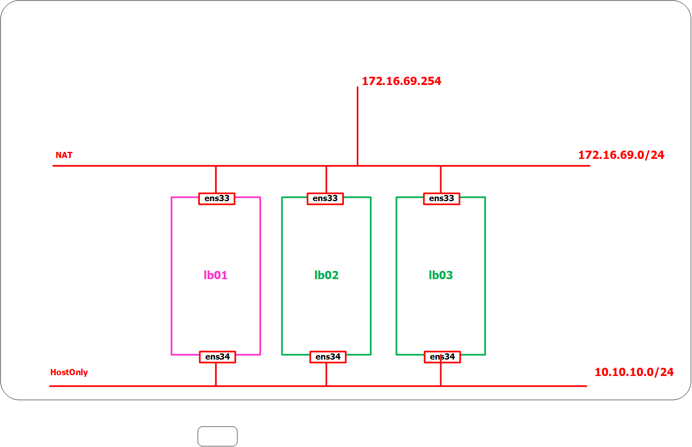
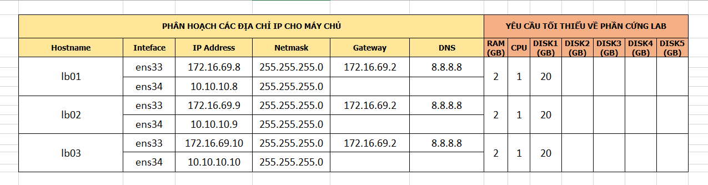

# Cài đặt pacemaker, corosync và modules nginx: nginx-vts và nginx-stream-sts, nginx-sts


# Mục lục

- [Môi trường cài đặt](#envir)
- [Mô hình hệ thống](#block)
- [IP Plan](#ipPlan)
- [Cài đặt nginx và modules](#nginx)
- [Kiểm tra cài đặt nginx](#test)
- [Cài đặt pacemaker và corosync để tạo cluster cho nginx](#pacemaker)
- [Cấu hình để thêm các resources vào Cluster](#configCluster)
- [Thêm resource NGINX để pacemaker quản lý.](#addResources)
- [Các nội dung khác](#content-others)


# Nội dung

- #### <a name="envir">Môi trường cài đặt</a>
	
	+ OS: CentOS7.3 1611 64 bit
	+ Nginx version: nginx/1.13.0
	+ Pacemaker: pacemaker-1.1.15-11.el7_3.4.x86_64
	+ Corosync: corosync-2.4.0-4.el7.x86_64

- #### <a name="block">Mô hình hệ thống</a>

	

- #### <a name="ipPlan">IP Plan</a>

	

- #### <a name="nginx">Cài đặt nginx và modules</a>

	+ Lưu ý:

			Các câu lệnh sau được thực hiện trên node lb01, lb02 và lb03

	+ Bước 1: Cài đặt nginx và các module vts, sts và stream sts để theo dõi thông tin traffic:

		- Download nginx-modules

			+ Bước 1: Download source code của module nginx-vts-module:

					mkdir /opt/downloads
					cd /opt/downloads
					echo "proxy=http://123.30.178.220:3142" >> /etc/yum.conf
					yum install git -y
					git clone https://github.com/vozlt/nginx-module-vts.git

			+ Bước 2: Download source code của nginx-sts-module:

					git clone https://github.com/vozlt/nginx-module-sts.git

			+ Bước 3: Download source code của nginx-stream-sts-module 2 module sts này phụ thuộc vào nhau:

					git clone https://github.com/vozlt/nginx-module-stream-sts.git

		- Download trình biên dịch để cài đặt nginx-modules:

				yum -y install gcc gcc-c++ make zlib-devel pcre-devel \
				openssl-devel git wget geoip-devel epel-release

		- Download source code cài đặt nginx

				yum autoremove nginx
				wget http://nginx.org/download/nginx-1.13.0.tar.gz
				tar -zxf nginx-1.13.0.tar.gz
				cd nginx-1.13.0

		- Thực hiện cài đặt nginx cùng với 3 module đã tải xuống:

				./configure --user=nginx --group=nginx \
				--add-module=/opt/downloads/nginx-module-sts/ \
				--add-module=/opt/downloads/nginx-module-vts/ \
				--add-module=/opt/downloads/nginx-module-stream-sts/ \
				--prefix=/etc/nginx \
				--sbin-path=/usr/sbin/nginx \
				--conf-path=/etc/nginx/nginx.conf \
				--error-log-path=/var/log/nginx/error.log \
				--http-log-path=/var/log/nginx/access.log \
				--pid-path=/var/run/nginx.pid \
				--lock-path=/var/run/nginx.lock \
				--http-client-body-temp-path=/var/cache/nginx/client_temp \
				--http-proxy-temp-path=/var/cache/nginx/proxy_temp \
				--http-fastcgi-temp-path=/var/cache/nginx/fastcgi_temp \
				--http-uwsgi-temp-path=/var/cache/nginx/uwsgi_temp \
				--http-scgi-temp-path=/var/cache/nginx/scgi_temp \
				--with-http_ssl_module \
				--with-http_realip_module \
				--with-http_addition_module \
				--with-http_sub_module \
				--with-http_dav_module \
				--with-http_gunzip_module \
				--with-http_gzip_static_module \
				--with-http_random_index_module \
				--with-http_secure_link_module \
				--with-http_stub_status_module \
				--with-mail \
				--with-mail_ssl_module \
				--with-file-aio \
				--with-stream \
				--with-http_geoip_module

				make
				make install
	
	- Tiếp theo cần chạy các câu lệnh dưới đây để có thể khởi động nginx, ... 

		+ Bước 1: Chạy các câu lệnh sau:
		
				useradd -r nginx
				mkdir -p /var/cache/nginx/client_temp/
				chown nginx. /var/cache/nginx/client_temp/
				vi /lib/systemd/system/nginx.service
			
		+ Bước 2: Thêm nội dung sau vào file, sau đó lưu lại:
		
				[Unit]
				Description=The NGINX HTTP and reverse proxy server
				After=syslog.target network.target remote-fs.target nss-lookup.target

				[Service]
				Type=forking
				PIDFile=/run/nginx.pid
				ExecStartPre=/usr/sbin/nginx -t
				ExecStart=/usr/sbin/nginx
				ExecReload=/bin/kill -s HUP $MAINPID
				ExecStop=/bin/kill -s QUIT $MAINPID
				PrivateTmp=true

				[Install]
				WantedBy=multi-user.target
			
		+ Bước 3: Tiếp tục chạy các câu lệnh sau để khởi động nginx:

				chmod a+rx /lib/systemd/system/nginx.service
				systemctl start nginx
				systemctl enable nginx
			
- #### <a name="test">Kiểm tra cài đặt nginx</a>

	+ Sau khi đã cài đặt thành công nginx lên trên node lb01, ta thực hiện chạy câu lệnh sau trên node lb01:

			cp /etc/nginx/nginx.conf /etc/nginx/nginx.conf.default
			vi /etc/nginx/nginx.conf

		thêm nội dung sau vào file và lưu lại:

			#user  nobody;
			worker_processes  1;

			#error_log  logs/error.log;
			#error_log  logs/error.log  notice;
			#error_log  logs/error.log  info;

			#pid        logs/nginx.pid;


			events {
			    worker_connections  1024;
			}


			## Trang thai cua cac stream
			stream {
			    server_traffic_status_zone;
			    upstream db-backends {
			        server 10.10.10.20:3306;
			        server 10.10.10.30:3306 backup;
			        server 10.10.10.40:3306 backup;
			    }
			    server {
			        listen 3306;
			        proxy_pass db-backends;
			    }
			}


			http {
			    include       mime.types;
			    default_type  application/octet-stream;

			    ## Trang thai cua cac VHOST
			    stream_server_traffic_status_zone;
			    vhost_traffic_status_zone;
			    geoip_country /usr/share/GeoIP/GeoIP.dat;
			    vhost_traffic_status_filter_by_set_key $geoip_country_code country::*;

			    sendfile        on;
			    #tcp_nopush     on;

			    #keepalive_timeout  0;
			    keepalive_timeout  65;

			    #gzip  on;
			    upstream web1 {
			        server 10.10.10.20;
			        server 10.10.10.30;
			    }
			    server {
			        listen 80;
			        server_name server01;
			        location / {
			            proxy_pass http://web1;
			        }
			    }

			    upstream web2 {
			        server 10.10.10.20;
			        server 10.10.10.40;
			    }
			    server {
			        listen 80;
			        server_name server02;
			        location / {
			            proxy_pass http://web2;
			        }
			    }

			    upstream web3 {
			    	server 10.10.10.30;
			    	server 10.10.10.40;
			    }

			    server {
			        listen 80;
			        server_name server03;
			        location / {
			            proxy_pass http://web3;
			        }
			    }
			    server {
			        listen       80;
			        server_name  _;
			        location / {
			            return 301 /status-web;
			        }
			        
			        ## Prefix cua trang xem trang thai
			        
			        location /status-stream {
			            stream_server_traffic_status_display;
			            stream_server_traffic_status_display_format html;
			        }
			        vhost_traffic_status_filter_by_set_key $geoip_country_code country::$server_name;
			        location /status-web {
			            vhost_traffic_status_display;
			            vhost_traffic_status_display_format html;
			        }
			        error_page   500 502 503 504  /50x.html;
			        location = /50x.html {
			            root   html;
			        }
			        location /status-native {
			            stub_status on;
			        }
			    }
			}

		bạn cũng có thể sử dụng nội dung của file cấu hình sau đây [config-nginx-stream-tcp-in-stream-block.conf](https://raw.githubusercontent.com/BoTranVan/ghichep-nginx/master/files/config-nginx-stream-tcp-in-stream-block.conf)

	+ Khởi động nginx

			systemctl start nginx 
			systemctl enable nginx

	+ Kiểm tra kết quả:

		- Sử dụng trình duyệt client truy cập tới địa chỉ http://your_ip/status-web để kiểm tra thông tin lưu lượng của virtual host trên server.
		- truy cập http://your_ip/status-stream để kiểm tra thông tin lưu lượng của stream tcp trên server.


- #### <a name="pacemaker">Cài đặt pacemaker và corosync để tạo cluster cho nginx</a>

	+ Lưu ý: 
			
			- Các câu lệnh sau thực hiện trên cả 3 node lb01, lb02 và lb03


	+ Tắt firewalld và disable selinux:

			sudo systemctl disable firewalld
			sudo systemctl stop firewalld

			sed -i 's/SELINUX=enforcing/SELINUX=disabled/g' /etc/sysconfig/selinux
			sed -i 's/SELINUX=enforcing/SELINUX=disabled/g' /etc/selinux/config

			init 6
	
	+ Thực hiện cấu hình trỏ host và proxy cho os để tăng tốc độ cài đặt

			echo "127.0.0.1        localhost" > /etc/hosts
			echo "10.10.10.8       lb01" >> /etc/hosts
			echo "10.10.10.9       lb02" >> /etc/hosts
			echo "10.10.10.10      lb03" >> /etc/hosts
			echo "10.10.10.20      db01" >> /etc/hosts
			echo "10.10.10.30      db02" >> /etc/hosts
			echo "10.10.10.40      db03" >> /etc/hosts
			echo "proxy=http://123.30.178.220:3142" >> /etc/yum.conf
	
	+ Cài đặt các gói cài đặt cần thiết cho pacemaker:

			yum -y install pacemaker pcs

		corosync sẽ được cài đặt kèm theo với câu lệnh trên như một phần mềm được phụ thuộc bởi pacemaker. Đồng thời, có một người dùng mới là `hacluster` sẽ được tạo ra và gán vào group `hacluster`

	+ Khởi động pacemaker

			systemctl start pcsd 
			systemctl enable pcsd

	+ Kiểm tra lại trạng thái của `pacemaker` bằng lệnh `systemctl startus pcsd`, kết quả như sau:

		 	Loaded: loaded (/usr/lib/systemd/system/pcsd.service; enabled; vendor preset: disabled)
			Active: active (running) since Sun 2017-06-04 23:10:52 EDT; 1h 7min ago
			 Main PID: 613 (pcsd)
				CGroup: /system.slice/pcsd.service
			           └─613 /usr/bin/ruby /usr/lib/pcsd/pcsd > /dev/null &

			Jun 04 23:10:47 lb01 systemd[1]: Starting PCS GUI and remote configuration interface...
			Jun 04 23:10:52 lb01 systemd[1]: Started PCS GUI and remote configuration interface.

	+ Thiết lập mật khẩu cho người dùng `hacluster`:

			passwd hacluster

		Lưu ý: đặt mật khẩu giống nhau trên cả 3 node.

	+ Đăng nhập vào trang quản lý pacemaker (Web GUI) qua địa chỉ ip của node. Ví dụ ở đây là https://172.172.16.69.10:2224

	+ Tạo cluster (Chỉ thực thiện trên cấu hình trên một node duy nhất)

		- Tạo xác thực giữa các node với nhau bằng câu lệnh:

				pcs cluster auth lb01 lb02 lb03

			sau đó nhập password của người dùng `hacluster` đã tạo ở phía trên. Kết quả nhận được như sau:

				#pcs cluster auth lb01 lb02 lb03
				 Username: hacluster
				 Password:
				 lb01: Authorized
				 lb02: Authorized
				 lb03: Authorized

		- Cấu hình cho cluster

				pcs cluster setup --name ha_cluster lb01 lb02 lb03

			trong câu lệnh trên:

				- ha_cluster là tên của cluster mà bạn sẽ tạo, mục này có thể nhập tùy ý.
				- lb01 lb02 và lb03 là hostname các máy chủ trong cụm cluster.
				  Muốn sử dụng tên này thì bạn phải chắc chắn đã khai báo trong file /etc/hosts

			kết quả nhân được như sau:

				Destroying cluster on nodes: lb01, lb02...
				lb01: Stopping Cluster (pacemaker)...
				lb02: Stopping Cluster (pacemaker)...
				lb03: Stopping Cluster (pacemaker)...
				lb01: Successfully destroyed cluster
				lb02: Successfully destroyed cluster
				lb03: Successfully destroyed cluster

				Sending cluster config files to the nodes...
				lb01: Succeeded
				lb02: Succeeded
				lb03: Succeeded

				Synchronizing pcsd certificates on nodes lb01, lb02...
				lb01: Success
				lb02: Success
				lb03: Success

				Restarting pcsd on the nodes in order to reload the certificates...
				lb01: Success
				lb02: Success
				lb03: Success

		- Khởi động lại cluster vừa tạo:

				pcs cluster start --all 

			kết quả nhân được như sau:

				lb03: Starting Cluster...
				lb02: Starting Cluster...
				lb01: Starting Cluster...

		- Kích hoạt cho phép cluster khởi động cùng với OS:

				pcs cluster enable --all 

			kết quả như sau:

				lb03: Cluster Enabled
				lb01: Cluster Enabled
				lb02: Cluster Enabled

		- Kiểm tra trạng thái của corosync

				pcs status corosync

			kết quả:

				Membership information
				----------------------
				    Nodeid      Votes Name
				         1          1 lb01 (local)
				         2          1 lb02
				         3          1 lb03


- #### <a name="configCluster">Cấu hình để thêm các resources vào Cluster</a>

	- Disable cơ chế `STONITH`
	  ```sh
	  pcs property set stonith-enabled=false
	  ```

	- Thiết lập policy cho cơ chế `quorum` (bỏ qua bước này nếu như bạn có chỉ có 2 node)
	  ```sh
	  pcs property set no-quorum-policy=ignore
	  ```

	- Disable auto failbask
	  ```sh
	  pcs property set default-resource-stickiness="INFINITY"
	  ```

	- Kiểm tra lại các thiết lập ở trên
	  ```sh
	  pcs property list 
	  ```
	  - Kết quả như bên dưới
	    ```sh
	    Cluster Properties:
	     cluster-infrastructure: corosync
	     cluster-name: ha_cluster
	     dc-version: 1.1.15-11.el7_3.4-e174ec8
	     default-resource-stickiness: INFINITY
	     have-watchdog: false
	     no-quorum-policy: ignore
	     stonith-enabled: false
	    ```


- #### <a name="addResources">Thêm resource NGINX để pacemaker quản lý.</a>

	- Chú ý: 
		- Resource chính là các ứng dụng được cấu hình cluster.
		- Tùy vào tài ngyên mà bạn muốn pacemaker quản lý thì sẽ được add thêm vào trong Cluster.
		- Khi add resource vào cluster thì việc   start, stop, restart` resource này sẽ do pacemaker quản lý. 
		- Corosync có nhiệm vụ làm messenger để báo cho các node biết tính hình các resource đang như thế nào.

	### Thêm resource Virtual IP (VIP) để pacemaker quản lý.

	- Thiết lập Virtual IP (VIP) cho Cluster. Lựa chọn 1 IP mà bạn muốn làm VIP, IP này chưa được sử dụng trong hệ thống nhé.
	- Trong bài lab này, tôi lựa chọn là `172.16.69.254`. 
	- Tên của resource là `Virtual_IP`
		```sh
		pcs resource create Virtual_IP ocf:heartbeat:IPaddr2 ip=172.16.69.254 cidr_netmask=32 op monitor interval=30s
		````

	- Kiểm tra trạng thái của các resource hiện tại. 
		```sh
		pcs status resources 
		```

	- Thực hiện add resource của NGINX, đặt tên là `Web_Cluster`
	- Yêu cầu cần có là nginx đã được cấu hình với mục tiêu là Load Blancing. 
	- Trong mô hình này tham khảo file cấu hình của NGINX ở đây, file này đã cấu hình NGINX làm chức năng Load Blancing cho nginx: [config-nginx-stream-tcp-in-http-block.conf](https://raw.githubusercontent.com/BoTranVan/ghichep-nginx/master/files/config-nginx-stream-tcp-in-http-block.conf) . Cần phải đảm bảo đã khai báo cấu hình này trên 3 node nginx.

		```sh
		pcs resource create Web_Cluster \
		ocf:heartbeat:nginx \
		configfile=/etc/nginx/nginx.conf \
		status10url \
		op monitor interval=5s 
		```

	- Kiểm tra trạng thái của các resource hiện tại. 
		```sh
		pcs status resources 
		```
	- Kết quả như bên dưới
		```
		Virtual_IP     (ocf::heartbeat:IPaddr2):       Started lb01
		Web_Cluster    (ocf::heartbeat:nginx): Started lb02
		```
  
	- Trong kết quả trên ta thấy 2 resource đang hoạt động trên 2 node khác nhau, cần thực hiện các bước dưới để cấu hình cluster được hoàn tất. 

  
	- ### Cấu hình điều kiện ràng buộc cho các resource
	- Cấu hình để thiết lập resource `Virtual_IP` và `Web_Cluster` hoạt động trên cùng 1 máy trong cụm cluster
		```sh 
		pcs constraint colocation add Web_Cluster with Virtual_IP INFINITY
		```

	- Thiết lập chế độ khởi động của các resource
		```sh
		pcs constraint order Virtual_IP then Web_Cluster
		````

	- Kiểm tra lại các thiết lập trên
		```sh
		pcs constraint
		```

	- Kết quả của lệnh trên như sau
		```sh
		Location Constraints:
		Ordering Constraints:
  			start Virtual_IP then start Web_Cluster (kind:Mandatory)
		Colocation Constraints:
  			Web_Cluster with Virtual_IP (score:INFINITY)
		Ticket Constraints:
		```
  
	- Kiểm tra lại trạng thái của các resource, ta sẽ thấy chúng được started trên cùng 1 node.
		```sh
		[root@lb1 nginx]# pcs status resources
 		Virtual_IP     (ocf::heartbeat:IPaddr2):       Started lb1
 		Web_Cluster    (ocf::heartbeat:nginx): Started lb1
		[root@lb1 nginx]#
		```

	- ### Kiểm tra hoạt động của Cluster 

	- Sử dụng lệnh `crm_mon -1` để kiểm tra hoạt động của cluster 
		```sh
		crm_mon -1
		```
	- Kết quả của lệnh `crm_mon -1`
	    ```sh
		Stack: corosync
		Current DC: lb03 (version 1.1.15-11.el7_3.4-e174ec8) - partition with quorum
		Last updated: Mon Jun  5 00:50:32 2017          Last change: Sun Jun  4 23:01:17 2017 by root via cibadmin on lb01

		3 nodes and 2 resources configured

		Online: [ lb01 lb02 lb03 ]

		Active resources:

		 Virtual_IP     (ocf::heartbeat:IPaddr2):       Started lb02
		 Web_Cluster    (ocf::heartbeat:nginx): Started lb02

	    ```
	    - Trong kết quả trên, ta có thể quan sát các resource đang được quản lý bởi pacemaker, các resource đang nằm trên node nào. 


- # <a name="content-others">Các nội dung khác</a>

	Sẽ cập nhật sau.

	+ [](#)