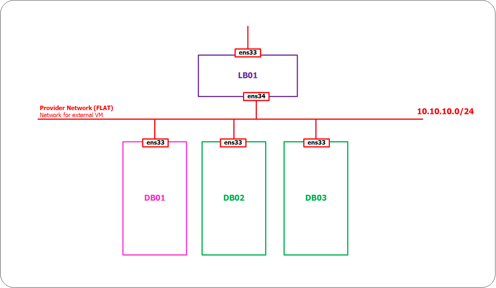
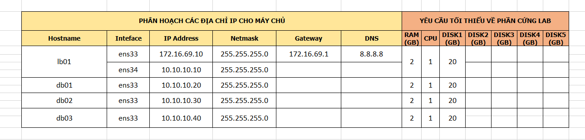

# 

# Mục lục

- [Vấn đề bài toán](#issue)
- [Cấu hình và cài đặt Galera Cluster](#install-gl)
- [Cấu hình và cài đặt Nginx](#install-n)
- [Kiểm tra](#test)

- [Các nội dung khác](#content-others)

# Nội dung

- #### <a name="issue">Vấn đề bài toán</a>

	+ Trong các web server với độ sẵn sàng cao luôn cần sự điều phối giữa các database cung cấp dữ liệu cho website. Điều này nhằm tránh tình trạng khi mà một website chỉ có một database mà database đó dừng hoạt động dẫn tới việc website đó dừng hoạt động theo. Để khác phục điều này, ta cần có một hoặc một vài database thay thế ngay tức khắc.

	+ Mô hình:

		

	+ IP Planning:

		

	+ Lưu ý:

			- Tất cả các node được sử dụng Centos 7 OS.

			- Tất cả các câu lệnh được chạy dưới quyền của người dùng root

- #### <a name="install-gl">Cấu hình và cài đặt Galera Cluster</a>

	+ Bước 1: Thực hiện cài đặt MariaDB trên cả 3 node DB01, DB02 và DB03 như sau:

			vi /etc/yum.repos.d/MariaDB.repo

		thêm nội dung sau vào file, sau đó lưu lại:

			[mariadb]
			name = MariaDB
			baseurl = http://yum.mariadb.org/10.1/centos7-amd64
			gpgkey=https://yum.mariadb.org/RPM-GPG-KEY-MariaDB
			gpgcheck=1

		+ Thực hiện trỏ host (thêm thông tin các host) vào file /etc/hosts trên cả 3 node:

				vi /etc/hosts

			thêm nội dung dưới đây vào file và sau đó lưu lại:

				10.10.10.10 lb03
				10.10.10.20 db01
				10.10.10.30 db02
				10.10.10.40 db03

		+ Cài đặt MariaDB trên lần lượt các node db01, db02 và db03

				yum install mariadb-server rsync

	+ Bước 2: Cấu hình cài đặt, tạo galera cluster cho 3 node db01, db02 và db03:

		+ Thực hiện trên node db01:

				vi /etc/my.cnf.d/server.cnf

		thêm nội dung sau vào file trong phần mục [galera] và lưu lại:

			# Mandatory settings
			wsrep_on=ON
			wsrep_provider=/usr/lib64/galera/libgalera_smm.so

			#add your node ips here
			wsrep_cluster_address="gcomm://db01,db02,db03"
			binlog_format=row
			default_storage_engine=InnoDB
			innodb_autoinc_lock_mode=2
			#Cluster name
			wsrep_cluster_name="galera_cluster"
			# Allow server to accept connections on all interfaces.

			bind-address=0.0.0.0

			# this server ip, change for each server
			wsrep_node_address="10.10.10.20"
			# this server name, change for each server
			wsrep_node_name="db01"

			wsrep_sst_method=rsync

		+ Thực hiện trên node db02:

				vi /etc/my.cnf.d/server.cnf

		thêm nội dung sau vào file trong phần mục [galera] và lưu lại:

			# Mandatory settings
			wsrep_on=ON
			wsrep_provider=/usr/lib64/galera/libgalera_smm.so

			#add your node ips here
			wsrep_cluster_address="gcomm://db01,db02,db03"
			binlog_format=row
			default_storage_engine=InnoDB
			innodb_autoinc_lock_mode=2
			#Cluster name
			wsrep_cluster_name="galera_cluster"
			# Allow server to accept connections on all interfaces.

			bind-address=0.0.0.0

			# this server ip, change for each server
			wsrep_node_address="10.10.10.30"
			# this server name, change for each server
			wsrep_node_name="db02"

			wsrep_sst_method=rsync

		+ Thực hiện trên node db03:

				vi /etc/my.cnf.d/server.cnf

		thêm nội dung sau vào file trong phần mục [galera] và lưu lại:

			# Mandatory settings
			wsrep_on=ON
			wsrep_provider=/usr/lib64/galera/libgalera_smm.so

			#add your node ips here
			wsrep_cluster_address="gcomm://db01,db02,db03"
			binlog_format=row
			default_storage_engine=InnoDB
			innodb_autoinc_lock_mode=2
			#Cluster name
			wsrep_cluster_name="galera_cluster"
			# Allow server to accept connections on all interfaces.

			bind-address=0.0.0.0

			# this server ip, change for each server
			wsrep_node_address="10.10.10.40"
			# this server name, change for each server
			wsrep_node_name="db03"

			wsrep_sst_method=rsync

	+ Bước 3: Tắt SeLinux và thực hiện mở port cho 3 node db01, db02 và db03:

		- Mở các port cho phép thực hiện truy vấn database và liên hệ giữa các node trong cụm galera:

				firewall-cmd --permanent --add-port=3306/tcp
				firewall-cmd --permanent --add-port=4567/tcp

		- Mở port cho phép rsync đồng bộ dữ liệu với nhau:

				firewall-cmd --permanent --add-port=873/tcp

		- Mở ports quan trọng khác:

				firewall-cmd --permanent --add-port=4444/tcp
				firewall-cmd --permanent --add-port=9200/tcp

		- Nạp lại chính sách firewall, ...:

				firewall-cmd --reload

	+ Bước 4: Khởi tạo galera cluster:

		- Câu lệnh này chỉ thực hiện trên một node, giả sử ta chạy trên node db01:

				galera new_cluster

			sau khi câu lệnh thực hiện chạy xong,  thực hiện chạy lệnh sau trên cả 2 node db02 và db03 để tiến hành đồng bộ:

				systemctl start mysql

		- Sau khi câu lệnh chạy hoàn tất, chạy câu lệnh sau để kiểm tra đã thực hiện cấu hình thành công hay chưa:

				mysql -u root -p -e "SHOW STATUS LIKE 'wsrep_cluster_size'"

			kết quả như sau:

				Enter password:
				+--------------------+-------+
				| Variable_name      | Value |
				+--------------------+-------+
				| wsrep_cluster_size | 3     |
				+--------------------+-------+

			Con số *3* chỉ số node đã join vào trong cụm galera.

- #### <a name="install-n">Cấu hình và cài đặt Nginx</a>
	
	+ Lưu ý:

			Các câu lệnh sau được thực hiện trên node lb01

	+ Bước 1: Cài đặt nginx và các module vts, sts và stream sts để theo dõi thông tin traffic:

		- Download nginx-modules

			+ Bước 1: Download source code của module nginx-vts-module:

					mkdir /opt/downloads
					cd /opt/downloads
					echo "proxy=http://123.30.178.220:3142" >> /etc/yum.conf
					yum install git -y
					git clone https://github.com/vozlt/nginx-module-vts.git

			+ Bước 2: Download source code của nginx-sts-module:

					git clone https://github.com/vozlt/nginx-module-sts.git

			+ Bước 3: Download source code của nginx-stream-sts-module 2 module sts này phụ thuộc vào nhau:

					git clone https://github.com/vozlt/nginx-module-stream-sts.git

		- Download trình biên dịch để cài đặt nginx-modules:

				yum -y install gcc gcc-c++ make zlib-devel pcre-devel \
				openssl-devel git wget geoip-devel epel-release

		- Download source code cài đặt nginx

				yum autoremove nginx
				wget http://nginx.org/download/nginx-1.13.0.tar.gz
				tar -zxf nginx-1.13.0.tar.gz
				cd nginx-1.13.0

		- Thực hiện cài đặt nginx cùng với 3 module đã tải xuống:

				./configure --user=nginx --group=nginx \
				--add-module=/opt/downloads/nginx-module-sts/ \
				--add-module=/opt/downloads/nginx-module-vts/ \
				--add-module=/opt/downloads/nginx-module-stream-sts/ \
				--prefix=/etc/nginx \
				--sbin-path=/usr/sbin/nginx \
				--conf-path=/etc/nginx/nginx.conf \
				--error-log-path=/var/log/nginx/error.log \
				--http-log-path=/var/log/nginx/access.log \
				--pid-path=/var/run/nginx.pid \
				--lock-path=/var/run/nginx.lock \
				--http-client-body-temp-path=/var/cache/nginx/client_temp \
				--http-proxy-temp-path=/var/cache/nginx/proxy_temp \
				--http-fastcgi-temp-path=/var/cache/nginx/fastcgi_temp \
				--http-uwsgi-temp-path=/var/cache/nginx/uwsgi_temp \
				--http-scgi-temp-path=/var/cache/nginx/scgi_temp \
				--with-http_ssl_module \
				--with-http_realip_module \
				--with-http_addition_module \
				--with-http_sub_module \
				--with-http_dav_module \
				--with-http_gunzip_module \
				--with-http_gzip_static_module \
				--with-http_random_index_module \
				--with-http_secure_link_module \
				--with-http_stub_status_module \
				--with-mail \
				--with-mail_ssl_module \
				--with-file-aio \
				--with-stream \
				--with-http_geoip_module

				make
				make install

- #### <a name="test">Kiểm tra</a>

	+ Sau khi đã cài đặt thành công nginx lên trên node lb01, ta thực hiện chạy câu lệnh sau trên node lb01:

			cp /etc/nginx/nginx.conf /etc/nginx/nginx.conf.default
			vi /etc/nginx/nginx.conf

		thêm nội dung sau vào file và lưu lại:

			#user  nobody;
			worker_processes  1;

			#error_log  logs/error.log;
			#error_log  logs/error.log  notice;
			#error_log  logs/error.log  info;

			#pid        logs/nginx.pid;

			events {
			    worker_connections  1024;
			}

			## Trang thai cua cac stream
			stream {
			    server_traffic_status_zone;
			    upstream db-backends {
			        server 10.10.10.20:3306;
			        server 10.10.10.30:3306 backup;
			        server 10.10.10.40:3306 backup;
			    }
			    server {
			        listen 3306;
			        proxy_pass db-backends;
			    }
			}

			http {
			    include       mime.types;
			    default_type  application/octet-stream;

			    ## Trang thai cua cac VHOST
			    stream_server_traffic_status_zone;
			    vhost_traffic_status_zone;
			    geoip_country /usr/share/GeoIP/GeoIP.dat;
			    vhost_traffic_status_filter_by_set_key $geoip_country_code country::*;

			    sendfile        on;
			    #tcp_nopush     on;

			    #keepalive_timeout  0;
			    keepalive_timeout  65;

			    #gzip  on;
			    upstream web1 {
			        server 10.10.10.20;
			        server 10.10.10.30;
			    }
			    server {
			        listen 80;
			        server_name server01;
			        location / {
			            proxy_pass http://web1;
			        }
			    }

			    upstream web2 {
			        server 10.10.10.20;
			        server 10.10.10.40;
			    }
			    server {
			        listen 80;
			        server_name server02;
			        location / {
			            proxy_pass http://web2;
			        }
			    }

			    upstream web3 {
			    	server 10.10.10.30;
			    	server 10.10.10.40;
			    }

			    server {
			        listen 80;
			        server_name server03;
			        location / {
			            proxy_pass http://web3;
			        }
			    }
			    server {
			        listen       80;
			        server_name  status-nginx.com;
			        location / {
			            return 301 /status-web;
			        }
			        
			        ## Prefix cua trang xem trang thai
			        
			        location /status-stream {
			            stream_server_traffic_status_display;
			            stream_server_traffic_status_display_format html;
			        }
			        vhost_traffic_status_filter_by_set_key $geoip_country_code country::$server_name;
			        location /status-web {
			            vhost_traffic_status_display;
			            vhost_traffic_status_display_format html;
			        }
			        error_page   500 502 503 504  /50x.html;
			        location = /50x.html {
			            root   html;
			        }
			        location /status-native {
			            stub_status on;
			        }
			    }
			}

		bạn cũng có thể sử dụng nội dung của file cấu hình sau đây [config-nginx-stream-tcp-in-stream-block.conf](https://raw.githubusercontent.com/BoTranVan/ghichep-nginx/master/files/config-nginx-stream-tcp-in-stream-block.conf)

	+ Khởi động nginx, mở port 3306:

			firewall-cmd --add-port=3306/tcp --permanent
			firewall-cmd --reload
			systemctl start nginx
			systemctl enable nginx
			
	+ Nếu như khi thực hiện các câu lệnh phía trên xảy ra lỗi thì bạn cần phải tiếp tục làm theo các bước dưới đây:
	
		+ Bước 1: Chạy các câu lệnh sau:
		
				useradd -r nginx
				mkdir -p /var/cache/nginx/client_temp/
				chown nginx. /var/cache/nginx/client_temp/
				vi /lib/systemd/system/nginx.service
			
		+ Bước 2: Thêm nội dung sau vào file, sau đó lưu lại:
		
				[Unit]
				Description=The NGINX HTTP and reverse proxy server
				After=syslog.target network.target remote-fs.target nss-lookup.target

				[Service]
				Type=forking
				PIDFile=/run/nginx.pid
				ExecStartPre=/usr/sbin/nginx -t
				ExecStart=/usr/sbin/nginx
				ExecReload=/bin/kill -s HUP $MAINPID
				ExecStop=/bin/kill -s QUIT $MAINPID
				PrivateTmp=true

				[Install]
				WantedBy=multi-user.target
			
		+ Bước 3: Tiếp tục chạy các câu lệnh sau để khởi động nginx:

				chmod a+rx /lib/systemd/system/nginx.service
				systemctl start nginx
				systemctl enable nginx
			
			
	+ Cấp quyền truy cập database từ xa, thực hiện trên node db01:

			mysql -u root -p

		sau đó chạy các câu lệnh sau:

			CREATE USER 'root'@'%' IDENTIFIED BY 'your_password';
			GRANT ALL PRIVILEGES ON *.* TO 'root'@'10.10.10.10' identified by 'your_password';

	+ Tiến hành cấu hình trỏ host trên client để kiểm tra bằng việc thêm nội dung sau vào file C:\Windows\System32\drivers\etc/hosts ( đối với Windows), tại /etc/hosts ( đối với Linux) trên client theo dạng:

			ip_server	status-nginx.com 

	Từ trình duyệt của client, truy cập tới địa chỉ

		+ http://status-nginx.com/status-stream để kiểm tra thông tin về các luồng xử lý trong server.

		+ http://status-nginx.com//status-web để kiểm tra thông tin về các truy cập tới VirtualHost

		+ Tải phần mềm HeidiSQL về để kiểm tra việc truy xuất database thông qua lb01 đã thành công hay chưa.

- # <a name="content-others">Các nội dung khác</a>

	Sẽ cập nhật sau.

	+ 
