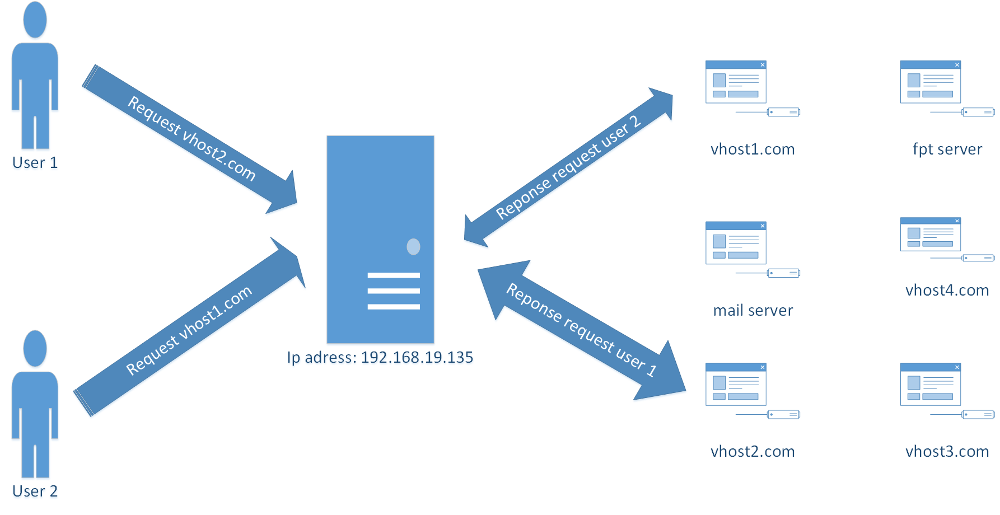
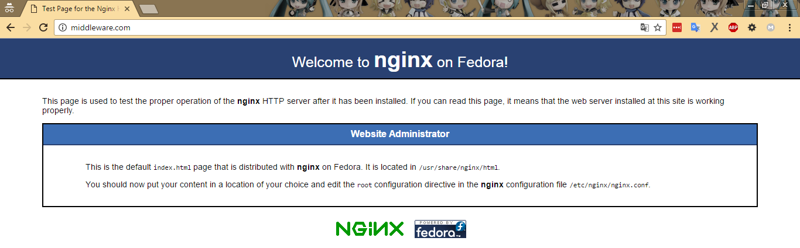
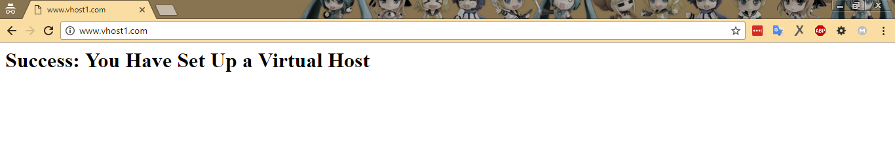

# Cách tạo virtual host (Server Block)

# Mục lục

1. [Virtual Host là gì?](#virtual-host)
2. [Cấu hình nhiều sử dụng nhiều Virtual Host trên cùng một server](#multiple-host)

# Nội dung

- #### <a name="virtual-host">Virtual Host là gì?</a>
    
    + *Virtual Host* là một kỹ thuật cho phép nhiều website có thể dùng chung một địa chỉ ip. Thuật ngữ này được sử dụng với các website sử dụng Apache server. Trong các website sử dụng Nginx server thì nó được gọi là *Server Block*

    + Đây là kỹ thuật dùng để cấu hình cho web server khi bạn muốn có nhiều nhiều website với các tên miền khác nhau được sử dụng chung trên cùng một máy chủ.
        

- #### <a name="multiple-host">Cấu hình sử dụng nhiều Virtual Host trên cùng một server</a>

    + ## Lưu ý: Nội dung cấu hình được thực hiện trên hệ điều hành CentOS 7 sử dụng thông qua giao diện dòng lệnh.

    + Nội dung trong phần này sẽ nói về cách để bạn thực hiện cấu hình server sao cho có thể nhiều website cùng sử dụng chung một địa chỉ ip duy nhất. Để thực hiện cấu hình, ta cần trải qua các bước sau:

        - Bước 1: Cài đặt nginx
        - Bước 2: Cấu hình domain chính cho server.
        - Bước 3: Cấu hình tạo ra các virtual host (Server Block)
        - Bước 4: Thực hiện trỏ host trên client để kiểm tra kết quả

        Đó là 4 bước chính để thực hiện cấu hình cho nội dung phần này. Chi tiết như sau:
    
    + Bước 1: Cài đặt nginx

        Xem chi tiết [tại đây](nginx-install.md#2)

    + Bước 2: Cấu hình domain chính cho server

        - Ta tiến hành sửa nội dung của file cấu hình chính cho nginx tại */etc/nginx/nginx.conf*. Tìm tới dòng có nội dung *server_name     _;* trong vùng cấu hình của *http*. Thay *_* bằng tên miền mà bạn muốn sử dụng. Ví dụ:

                http {
                    ...
                    server {
                        ...
                        server_name     www.middleware.com middleware.com;
                        ...
                    }
                    ...
                }

    - Bước 3: Cấu hình tạo ra các Virtual Host.

        - Bước 1: Tạo virtual host thứ nhất.

                # vi /etc/nginx/conf.d/vhost1.com.conf

            Tiếp theo ta cần thêm nội dung cấu hình cho file vừa tạo trên với nội dung:

                    server {
                        listen      80;
                        server_name     vhost1.com www.vhost1.com;
                        access_log      /var/log/nginx/access-vhost1.com.log;
                        error_log       /var/log/nginx/error-vhost1.com.log;
                        root    /usr/share/nginx/vhost1.com;
                        index   index.php index.html index.htm;
                    }

            - Tạo thư mục chứa website cho virtual host này:

                    # mkdir /usr/share/nginx/vhost1.com
                    # chown nginx:nginx -R /usr/share/nginx/vhost1.com

            - Tạo một file index.html để kiểm tra kết quả:

                    # vi /usr/share/nginx/vhost1.com/index.html

            - Thêm vào file nội dung sau:

                    <DOCTYPE html>
                    <html>
                      <head>
                        <title>www.vhost1.com</title>
                      </head>
                      <body>
                        <h1>Success: You Have Set Up a Virtual Host</h1>
                        <h1>www.vhost1.com and vhost1.com</h1>
                      </body>
                    </html>

        - Bước 2: Tạo ra virtual host thứ hai.

                # vi /etc/nginx/conf.d/vhost2.com.conf

            Tiếp theo ta cần thêm nội dung cấu hình cho file vừa tạo trên với nội dung:

                    server {
                        listen      80;
                        server_name     vhost2.com www.vhost2.com;
                        access_log      /var/log/nginx/access-vhost2.com.log;
                        error_log       /var/log/nginx/error-vhost2.com.log;
                        root    /usr/share/nginx/vhost2.com;
                        index   index.php index.html index.htm;
                    }

            - Tạo thư mục chứa website cho virtual host này:

                    # mkdir /usr/share/nginx/vhost2.com
                    # chown nginx:nginx -R /usr/share/nginx/vhost2.com

            - Tạo một file index.html để kiểm tra kết quả:

                    # vi /usr/share/nginx/vhost2.com/index.html

            - Thêm vào file nội dung sau:

                    <DOCTYPE html>
                    <html>
                      <head>
                        <title>www.vhost2.com</title>
                      </head>
                      <body>
                        <h1>Success: You Have Set Up a Virtual Host</h1>
                        <h1>www.vhost2.com and vhost2.com</h1>
                      </body>
                    </html>

        - Bước 4: Tiến hành cấu hình trỏ host trên client để kiểm tra bằng việc thêm nội dung sau vào file *C:\Windows\System32\drivers\etc/hosts* trên client theo dạng:

                ip-address      server_name[s]

        Ví dụ:

                192.168.19.35 middleware.com www.middleware.com vhost1.com www.vhost1.com www.vhost2.com vhost2.com

        Kết quả nếu thực hiện đúng, sẽ trong thấy giống như thế này:

            - Khi ta truy cập: middleware.com hoặc www.middleware.com qua trình duyệt của client:

        >

            - Khi ta truy cập: vhost1.com hoặc www.vhost1.com qua trình duyệt của client:

        >

            - Khi ta truy cập: vhost2.com hoặc www.vhost2.com qua trình duyệt của client:

        >

    Chúc các bạn thành công.