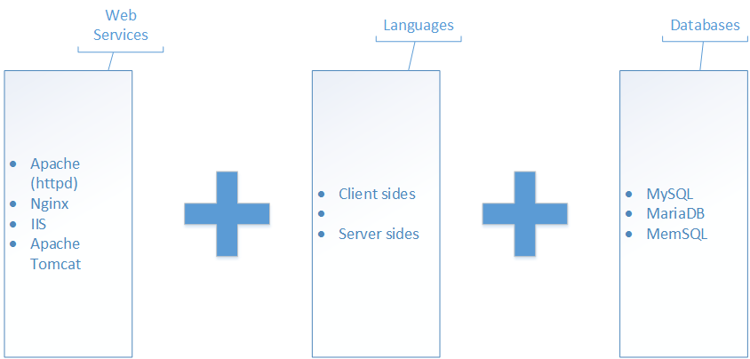
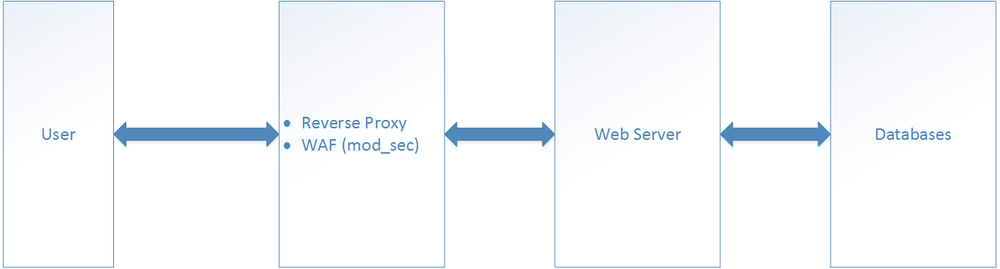

# Ứng dụng của Web Applications Firewall (WAF)

# Mục lục

- [Web Applications Firewall là gì?](#whatis)
- [Các phần mềm mã nguồn mở cung cấp WAF](#opensource)
- [Cài đặt WAF kết hợp nginx](#settings)
- [Cấu hình cho nginx với waf](#configure)
- [Kiểm tra kết quả](#test)
- [Các nội dung khác](#content-others)

# Nội dung

- #### <a name="whatis">Web Applications Firewall là gì?</a>

	
	
	- Bên trên chính là một mô hình nền tảng web phổ biến hiện nay. Với mô hình này, website có thể bị tấn công qua các hình thức:

		+ Thông qua Authencation (Tấn công mật khẩu, giao thức mã hóa, tấn công xác thực)
		+ Thông qua Session, Transport (Các hình thức tấn công bảo mật thông qua đường truyền, bao gồm cả MITM)
		+ Thông qua lỗ hổng Web Applications
		+ Thông qua lỗ hổng OS
		+ Thông qua Server Applications
		+ Thông qua mã độc hoặc backdoors đã được thiết lập từ trước.
		+ Thông qua các hình thức tấn công từ chối dịch vụ (DoS, DDoS, DRDoS, Spam, ..)
		+ Thông qua Crawler hoặc các kẽ hở trong cấu hình và quản lý.
		+ Thông qua tấn công vật lý
		+ Thông qua tâm lý con người.

	- Với 10 quy chuẩn bảo mật và cũng là 10 phân nhánh lỗ hổng bảo mật ứng dụng web theo OWASP:

		+ Injection (SQLi, LDPAi, OSCi, ...)
		+ Cross Site Scripting (XSS)
		+ Broken Authencation and Session Management
		+ Insecure Direct Object References
		+ Cross Site Request Forgery (CSRF)
		+ Secure Misconfiguration
		+ Insecure Cryptographic Storage
		+ Failure to Restrict URL Access
		+ Insufficient Transport Layer Protection
		+ Unvalidciated Redirect and Foreards

	- Giải pháp cho Web Applications Security:

		+ An toàn source code: Fix lỗ hổng trong source code
		+ Authencation: Áp dụng các hình thức mã hóa, chứng thực phù hợp.
		+ Đảm bảo toàn vẹn dữ liệu
		+ Permission: Phân quyền truy cập tài nguyên phù hợp
		+ Giả lập đường dẫn web, giấu file cấu hình, tạo bẫy (honeyport hay port ảo), lợi dụng mod_rewirte, ...
		+ Sử dụng `*#Web Applications Firewall*`

	- Tính năng của Web Applications Firewall:

		

		+ Quản trị tập trung
		+ Đảm bảo an toàn cho web applications
		+ Tiết kiệm chi phí và hiệu quả hơn
		+ Hỗ trợ nhiều tính năng mở rộng
		+ Hoạt động và bảo vệ Layer 7 trong mô hình OSI, chống các cuộc tấn công hướng tới
		+ Phân tích, lọc, kiểm duyệt, thậm chí sử đổi header body và request body, response body, ...
		+ Kiểm soát cookies, Fake port, Fake Comment, Fake Component, ...
		+ Đưa ra phương thức phòng vệ chống lại các hoạt động khai thác lỗ hổng, tấn công đánh cắp dữ liệu hay tấn công từ chối dịch vụ,...
		+ Phân tích yêu cầu và cảnh báo ngay khi có một hoạt động đánh nghi nào đó trên hệ thống.
		+ Tăng khả năng hiển thị của lưu lượng website

- #### <a name="opensource">Các phần mềm mã nguồn mở cung cấp WAF</a>

	+ [ModSecurity (Trustwave SpiderLabs)](http://www.modsecurity.org/)
	+ [Shadow Daemon](https://shadowd.zecure.org/)
	+ [AQTRONIX WebKnight](http://www.aqtronix.com/?PageID=99)
	+ [ESAPI WAF](https://www.owasp.org/index.php/The_ESAPI_Web_Application_Firewall_%28ESAPI_WAF%29)
	+ [WebCastellum](http://www.webcastellum.org/)
	+ [Binarysec](http://www.binarysec.com/cms/index.html)
	+ [Guardian@JUMPERZ.NET](http://www.jumperz.net/index.php)
	+ [Ironbee](https://www.ironbee.com/)
	+ [Profense](http://www.zionsecurity.com/solutions/implementation/web-application-firewall.aspx)
	+ [Smoothwall](http://www.smoothwall.net/live/index.php)

- #### <a name="settings">Cài đặt WAF kết hợp nginx</a>

	- Trong nội dung bài viết này, mình sẽ sử dụng môi trường như sau:

		+ OS triển khai: Centos 7
		+ Opensource WAF: [ModSecurity (Trustwave SpiderLabs)](http://www.modsecurity.org/) phiên bản 2.9.1 được download tại [GitHub - SpiderLabs](https://github.com/SpiderLabs/ModSecurity/tree/nginx_refactoring)
		+ Web Services: Nginx phiên bản 1.12.0 được download tại [Nginx - Downloads](http://nginx.org/download/nginx-1.12.0.tar.gz)
		+ Mô hình triển khai:

			

		+ Lí do triển khai WAF ngay trên Reverse Proxy:

			- Để đảm bảo an toàn cho Web Server bên trong khi các cuộc tấn công nặng nề.
			- Giảm thiểu tài nguyên tiêu tốn cho Web Server vì các WAF cần một lượng tài nguyên không nhỏ.
			- WAF cũng có thể kiểm soát được tài nguyên tĩnh được Caching trên Reverse Proxy

		+ Giới thiệu về ModSecurity:

			- Là một WAF
			- Được xem như là một module phát triển cho nginx hoặc apache
			- Opensource có thể mở rộng và miễn phí sử dụng.
			- Hoạt động trên layer 7 của mô hình OSI, ghi log và kiểm soát hoạt động theo các rules.
				- Kiểm soát các request và response trong cả header và body, nếu phát hiện các dấu hiệu tấn công theo rules. ModSecurity sẽ thực hiện hoạt động đã được định sẵn theo từng rules và ghi lại logs các hành động đó.

	- Tiến hành cài đặt

		+ Cài đặt các package yêu cầu cho việc compiling:

				yum install -y gcc gcc-c++make automake autoconf libtool pcre pcre-devel \
				libxml2 libxml2-devel curl curl-devel httpd-devel wget git openssl-devel \
				zlib-devel geoip-devel epel-release
		
		+ Compiling source code của ModSecurity từ GitHub

				cd /opt
				git clone -b nginx_refactoring https://github.com/SpiderLabs/ModSecurity.git
				cd ModSecurity
				sed -i '/AC_PROG_CC/a\AM_PROG_CC_C_O' configure.ac
				sed -i '1 i\AUTOMAKE_OPTIONS = subdir-objects' Makefile.am
				./autogen.sh
				./configure --enable-standalone-module --disable-mlogc
				make && make install

		+ Thực hiện download và giải nén source code của nginx:

				cd /opt
				mkdir downloads && cd $_
				wget http://nginx.org/download/nginx-1.12.0.tar.gz
				tar -zxf nginx-1.12.0.tar.gz
				cd nginx-1.12.0

		+ Compiling nginx cùng với ModSecurity trong quá trình cài đặt:

				./configure --user=nginx --group=nginx \
				--add-module=/opt/ModSecurity/nginx/modsecurity/ \
				--prefix=/etc/nginx \
				--sbin-path=/usr/sbin/nginx \
				--conf-path=/etc/nginx/nginx.conf \
				--error-log-path=/var/log/nginx/error.log \
				--http-log-path=/var/log/nginx/access.log \
				--pid-path=/var/run/nginx.pid \
				--lock-path=/var/run/nginx.lock \
				--http-client-body-temp-path=/var/cache/nginx/client_temp \
				--http-proxy-temp-path=/var/cache/nginx/proxy_temp \
				--http-fastcgi-temp-path=/var/cache/nginx/fastcgi_temp \
				--http-uwsgi-temp-path=/var/cache/nginx/uwsgi_temp \
				--http-scgi-temp-path=/var/cache/nginx/scgi_temp \
				--with-http_ssl_module \
				--with-http_realip_module \
				--with-http_addition_module \
				--with-http_sub_module \
				--with-http_dav_module \
				--with-http_gunzip_module \
				--with-http_gzip_static_module \
				--with-http_random_index_module \
				--with-http_secure_link_module \
				--with-http_stub_status_module \
				--with-mail \
				--with-mail_ssl_module \
				--with-file-aio \
				--with-stream \
				--with-http_geoip_module

				make
				make install

	- Để hoàn tất quá trình cài đặt, bạn cần phải tiếp tục làm theo các bước dưới đây:
	
		+ Bước 1: Chạy các câu lệnh sau:
		
				useradd -r nginx
				mkdir -p /var/cache/nginx/client_temp/
				chown nginx. /var/cache/nginx/client_temp/
				vi /lib/systemd/system/nginx.service
			
		+ Bước 2: Thêm nội dung sau vào file, sau đó lưu lại:
		
				[Unit]
				Description=The NGINX HTTP and reverse proxy server
				After=syslog.target network.target remote-fs.target nss-lookup.target

				[Service]
				Type=forking
				PIDFile=/run/nginx.pid
				ExecStartPre=/usr/sbin/nginx -t
				ExecStart=/usr/sbin/nginx
				ExecReload=/bin/kill -s HUP $MAINPID
				ExecStop=/bin/kill -s QUIT $MAINPID
				PrivateTmp=true

				[Install]
				WantedBy=multi-user.target
			
		+ Bước 3: Tiếp tục chạy các câu lệnh sau để khởi động nginx:

				chmod a+rx /lib/systemd/system/nginx.service
				systemctl start nginx
				systemctl enable nginx

- #### <a name="configure">Cấu hình cho nginx với waf</a>

	- Cấu hình nginx

			vi /etc/nginx/conf/nginx.conf

		tìm đến nội dung trong khối `http {}`:

			location / {
			    root   html;
			    index  index.html index.htm;
			}

		chèn thêm nội dung sau vào trong khối `location {}`:

			ModSecurityEnabled on;
			ModSecurityConfig modsec_includes.conf;
			#proxy_pass http://localhost:8011;
			#proxy_read_timeout 180s;

		kết quả cuối cùng sẽ được như sau và sau đó lưu lại file cấu hình này:

			location / {
			    ModSecurityEnabled on;
			    ModSecurityConfig modsec_includes.conf;
			    proxy_pass http://localhost:8011;
			    proxy_read_timeout 180s;
			    root   html;
			    index  index.html index.htm;
			}

	- Cấu hình cho ModSecurity:

			vi modsec_includes.conf
			
		sau đó thêm nội dung sau vào file và lưu lại:

			include modsecurity.conf
			include owasp-modsecurity-crs/crs-setup.conf
			include owasp-modsecurity-crs/rules/*.conf

	- Import file cấu hình cho ModSecurity

			cp /opt/ModSecurity/modsecurity.conf-recommended /etc/nginx/modsecurity.conf
			cp /opt/ModSecurity/unicode.mapping /etc/nginx/

	- Sửa nội dung file modsecurity.conf:

			sed -i "s/SecRuleEngine DetectionOnly/SecRuleEngine On/" /etc/nginx/modsecurity.conf

	- Thêm file OWASP ModSecurity CRS (Core Rule Set):

			cd /etc/nginx
			git clone https://github.com/SpiderLabs/owasp-modsecurity-crs.git
			cd owasp-modsecurity-crs
			mv crs-setup.conf.example crs-setup.conf
			cd rules
			mv REQUEST-900-EXCLUSION-RULES-BEFORE-CRS.conf.example REQUEST-900-EXCLUSION-RULES-BEFORE-CRS.conf
			mv RESPONSE-999-EXCLUSION-RULES-AFTER-CRS.conf.example RESPONSE-999-EXCLUSION-RULES-AFTER-CRS.conf

- #### <a name="test">Kiểm tra kết quả cài đặt</a>

	+ Khởi động lại nginx

			systemctl restart nginx

	+ Đến bước này, bạn có thể kiếm tra bằng việc đọc file log của nginx:

			tailf /var/log/nginx/error.log

		nếu thấy dòng chữ sau thì coi như đã cài đặt ModSecurity cho nginx thành công:

			 ModSecurity: StatusEngine call successfully sent. For more information visit: http://status.modsecurity.org/
	
	+ Kiểm tra cấu hình rules mặc định:

		- Mở port 80 và cho phép truy cập ra bên ngoài:

				firewall-cmd --zone=public --permanent --add-service=http
				firewall-cmd --reload
	
		- Thực hiện truy cập tới server mà bạn đang cấu hình từ máy client theo địa chỉ có dạng:

				http://ip_server/?param=">""

		- Tiếp theo, chúng ta thực hiện đọc log của nginx để kiểm tra thông tin

				tailf /var/log/nginx/error.log

			nội dung sẽ nhận lại được tương tự như sau:

				[error] 31268#0: [client 172.16.69.1] ModSecurity: Warning. detected XSS using libinjection. [file "/etc/nginx/owasp-modsecurity-crs/rules/REQUEST-941-APPLICATION-ATTACK-XSS.conf"] [line "64"] [id "941100"] [rev "2"] [msg "XSS Attack Detected via libinjection"] [data "Matched Data:  found within ARGS:param: \x22>\x22"] [severity "CRITICAL"] [ver "OWASP_CRS/3.0.0"] [maturity "1"] [accuracy "9"] [tag "application-multi"] [tag "language-multi"] [tag "platform-multi"] [tag "attack-xss"] [tag "OWASP_CRS/WEB_ATTACK/XSS"] [tag "WASCTC/WASC-8"] [tag "WASCTC/WASC-22"] [tag "OWASP_TOP_10/A3"] [tag "OWASP_AppSensor/IE1"] [tag "CAPEC-242"] [hostname ""] [uri "/"] [unique_id "AcAdQcAcAcWcycAcAcnc7cY1"]
				[error] 31268#0: [client 172.16.69.1] ModSecurity: Warning. Pattern match "(?i)([<\xef\xbc\x9c]script[^>\xef\xbc\x9e]*[>\xef\xbc\x9e][\\s\\S]*?)" at ARGS:param. [file "/etc/nginx/owasp-modsecurity-crs/rules/REQUEST-941-APPLICATION-ATTACK-XSS.conf"] [line "99"] [id "941110"] [rev "2"] [msg "XSS Filter - Category 1: Script Tag Vector"] [data "Matched Data: \x22"] [severity "CRITICAL"] [ver "OWASP_CRS/3.0.0"] [maturity "4"] [accuracy "9"] [tag "application-multi"] [tag "language-multi"] [tag "platform-multi"] [tag "attack-xss"] [tag "OWASP_CRS/WEB_ATTACK/XSS"] [tag "WASCTC/WASC-8"] [tag "WASCTC/WASC-22"] [tag "OWASP_TOP_10/A3"] [tag "OWASP_AppSensor/IE1"] [tag "CAPEC-242"] [hostname ""] [uri "/"] [unique_id "AcAdQcAcAcWcycAcAcnc7cY1"]
				[error] 31268#0: [client 172.16.69.1] ModSecurity: Warning. Pattern match "(?i)<[^\\w<>]*(?:[^<>\"'\\s]*:)?[^\\w<>]*(?:\\W*?s\\W*?c\\W*?r\\W*?i\\W*?p\\W*?t|\\W*?f\\W*?o\\W*?r\\W*?m|\\W*?s\\W*?t\\W*?y\\W*?l\\W*?e|\\W*?s\\W*?v\\W*?g|\\W*?m\\W*?a\\W*?r\\W*?q\\W*?u\\W*?e\\W*?e|(?:\\W*?l\\W*?i\\W*?n\\W*?k|\\W*?o\\W*?b\\W*?j\\W*?e\ ..." at ARGS:param. [file "/etc/nginx/owasp-modsecurity-crs/rules/REQUEST-941-APPLICATION-ATTACK-XSS.conf"] [line "236"] [id "941160"] [rev "2"] [msg "NoScript XSS InjectionChecker: HTML Injection"] [data "Matched Data: \x22"] [severity "CRITICAL"] [ver "OWASP_CRS/3.0.0"] [maturity "1"] [accuracy "8"] [tag "application-multi"] [tag "language-multi"] [tag "platform-multi"] [tag "attack-xss"] [tag "OWASP_CRS/WEB_ATTACK/XSS"] [tag "WASCTC/WASC-8"] [tag "WASCTC/WASC-22"] [tag "OWASP_TOP_10/A3"] [tag "OWASP_AppSensor/IE1"] [tag "CAPEC-242"] [hostname ""] [uri "/"] [unique_id "AcAdQcAcAcWcycAcAcnc7cY1"]
				[error] 31268#0: [client 172.16.69.1] ModSecurity: Warning. Pattern match "^[\\d.:]+$" at REQUEST_HEADERS:Host. [file "/etc/nginx/owasp-modsecurity-crs/rules/REQUEST-920-PROTOCOL-ENFORCEMENT.conf"] [line "810"] [id "920350"] [rev "2"] [msg "Host header is a numeric IP address"] [data "172.16.69.8"] [severity "WARNING"] [ver "OWASP_CRS/3.0.0"] [maturity "9"] [accuracy "9"] [tag "application-multi"] [tag "language-multi"] [tag "platform-multi"] [tag "attack-protocol"] [tag "OWASP_CRS/PROTOCOL_VIOLATION/IP_HOST"] [tag "WASCTC/WASC-21"] [tag "OWASP_TOP_10/A7"] [tag "PCI/6.5.10"] [hostname ""] [uri "/"] [unique_id "AcAdQcAcAcWcycAcAcnc7cY1"]
				[error] 31268#0: *3 connect() failed (111: Connection refused) while connecting to upstream, client: 172.16.69.1, server: localhost, request: "GET /?param=%22%3E%3Cscript%3Ealert(1);%3C/script%3E%22 HTTP/1.1", upstream: "http://127.0.0.1:8011/?param=%22%3E%3Cscript%3Ealert(1);%3C/script%3E%22", host: "172.16.69.8"
				[error] 31268#0: [client 172.16.69.1] ModSecurity: Audit log: Failed to lock global mutex: Permission denied [hostname ""] [uri "/"] [unique_id "AcAdQcAcAcWcycAcAcnc7cY1"]
				[error] 31268#0: [client 172.16.69.1] ModSecurity: Audit log: Failed to unlock global mutex: Permission denied [hostname ""] [uri "/"] [unique_id "AcAdQcAcAcWcycAcAcnc7cY1"]

			điều này đã cho thấy ModSecurity đang được hoạt động cùng nginx.

			
- # <a name="content-others">Các nội dung khác</a>

	Sẽ cập nhật sau.

	+ 