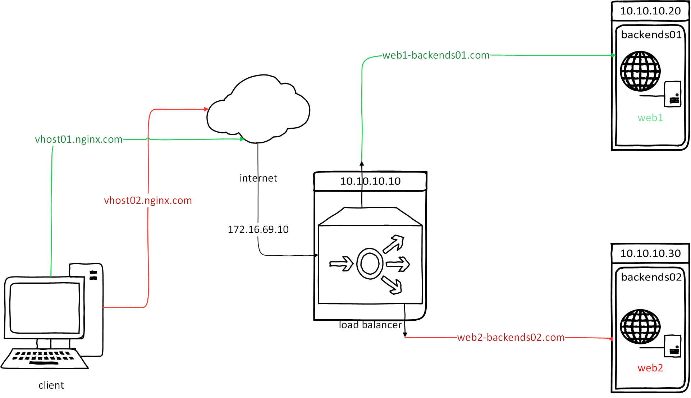
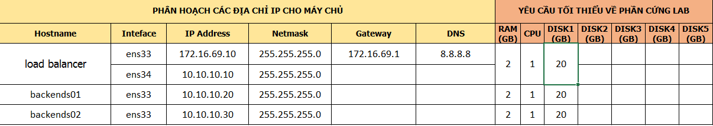

# Sử dụng virtual host điều hướng các request tới load balancer

# Mục lục

- [Vấn đề yêu cầu](#issue)
- [Tiến hành giải quyết](#resolve)
	- [Tạo virtual host](#create-sb)
	- [Cấu hình trỏ host để kiểm tra kết quả](#configure)

# Nội dung

- #### <a name="issue">Vấn đề yêu cầu</a>
	
	+ Trong một công ty lớn, qua từng thời kì sẽ có những website được tạo ra trên các nền tảng khác nhau. Sẽ tốn rất nhiều thời gian,... cho việc xây dựng lại toàn bộ website sử dụng cùng trên một nền tảng. Vấn đề đặt ra là ta chỉ có một địa chỉ ip public duy nhất đại diện cho cả công ty. Vậy làm thế nào để ta có thể giải quyết việc chỉ có một địa chỉ ip duy nhất ấy ta có thể tới được các website khác nhau qua nhiều domain website cùng sử dụng địa chỉ ip này?

	+ Mô hình của vấn đề trên có thể được minh họa như trong hình sau:

		> 

		
	+ IP Planning

		> 

- #### <a name="resolve">Tiến hành giải quyết</a>

	- Để tiến hành thực hiện cấu hình, ta cần cài đặt nginx lên 3 máy chủ: *load balancer*, *backends01*, *backends02*. Chi tiết cấu hình và cài đặt có thể xem [tại đây](nginx-install.md#2).

	- #### <a name="create-sb">Tạo virtual host</a>
		
		+ Cấu hình tại máy chủ backends01:
			- Thêm file */etc/nginx/conf.d/web1-backends01.conf*:

					# touch /etc/nginx/conf.d/web1-backends01.conf

			- Thêm nội dung sau vào file vừa tạo:

					# vi /etc/nginx/conf.d/web1-backends01.conf

				Nội dung:
					
					allow 10.10.10.10;
					deny all;
					server {
						listen 80;
						server_name www.web1-backends01.com web1-backends01.com;
						root /usr/share/nginx/web1-backends01;
							index index.php index.html index.cgi;
						location / {
						}
					}
			- Tạo thư mục chứa nội dung web dùng cho kiểm tra kết quả:
					
					# mkdir /usr/share/nginx/web1-backends01
					# vi /usr/share/nginx/web1-backends01/index.html
					

				Thêm nội dung sau vào file index.html:

					web1-backends01
						
			- Khởi động lại nginx

					# service nginx restart

		+ Cấu hình tại máy chủ backends02:
			- Thêm file */etc/nginx/conf.d/web2-backends02.conf*:

					# touch /etc/nginx/conf.d/web2-backends02.conf

			- Thêm nội dung sau vào file vừa tạo:
			
					# vi /etc/nginx/conf.d/web2-backends02.conf

				Nội dung:
					
					allow 10.10.10.10;
					deny all;
					server {
						listen 80;
						server_name www.web2-backends02.com web2-backends02.com;
						root /usr/share/nginx/web2-backends02;
							index index.php index.html index.cgi;
						location / {
						}
					}
			- Tạo thư mục chứa nội dung web dùng cho kiểm tra kết quả:
					
					# mkdir /usr/share/nginx/web2-backends02
					# vi /usr/share/nginx/web2-backends02/index.html
					

				Thêm nội dung sau vào file index.html:

					web2-backends02
						
			- Khởi động lại nginx

					# service nginx restart

		+ Cấu hình tại máy chủ load balancer:
			- Tạo 2 virtual host cho 2 máy chủ web backends01 và backends02:

				+ Tạo virtual host vhost01.nginx.com cho máy chủ backends01:

						# vi /etc/nginx/conf.d/vhost01.nginx.com.conf

					Thêm vào nội dung:

						server {
							listen 80;
							server_name www.vhost01.nginx.com vhost01.nginx.com;
							
							location / {
								proxy_pass http://web1-backends01.com;
							}
						}

				+ Tạo virtual host vhost02.nginx.com cho máy chủ backends02:

						# vi /etc/nginx/conf.d/vhost02.nginx.com.conf

					Thêm vào nội dung:

						server {
							listen 80;
							server_name www.vhost02.nginx.com vhost02.nginx.com;
							
							location / {
								proxy_pass http://web2-backends02.com;
							}
						}
				
				- Khởi động lại nginx

					# service nginx restart

	- #### <a name="configure">Cấu hình trỏ host để kiểm tra kết quả</a>

		+ Thực hiện cấu hình tại máy chủ *load balancer*:

			+ Tiến hành cấu hình trỏ host:

				Sửa file */etc/hosts*:

					# vi /etc/hosts
						
				Thêm nội dung sau vào file:

					10.10.10.20 www.web1-backends01.com web1-backends01.com

					10.10.10.30 www.web2-backends02.com web2-backends02.com

		+ Tiến hành cấu hình trỏ host trên client để kiểm tra bằng việc thêm nội dung sau vào file *C:\Windows\System32\drivers\etc/hosts* ( đối với Windows), tại */etc/hosts* ( đối với Linux) trên client theo dạng:

                172.16.69.10 www.vhost01.nginx.com vhost01.nginx.com www.vhost02.nginx.com vhost02.nginx.com

        + Tiến hành kiểm tra, tại trình duyệt gõ địa chỉ vhost01.nginx.com hoặc vhost02.nginx.com để kiểm tra kết quả.