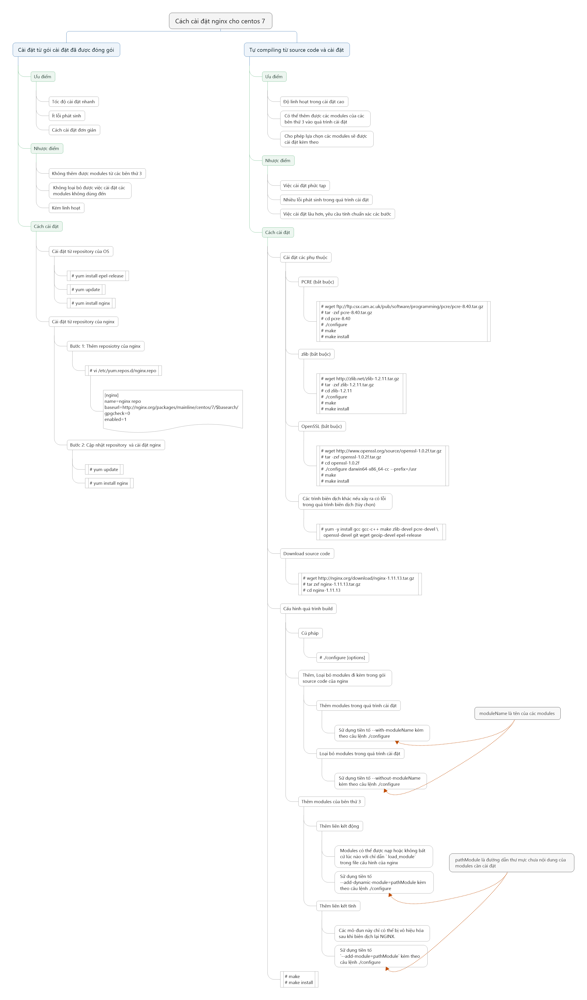
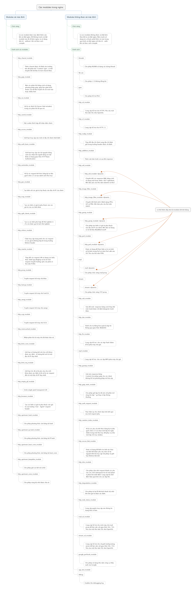
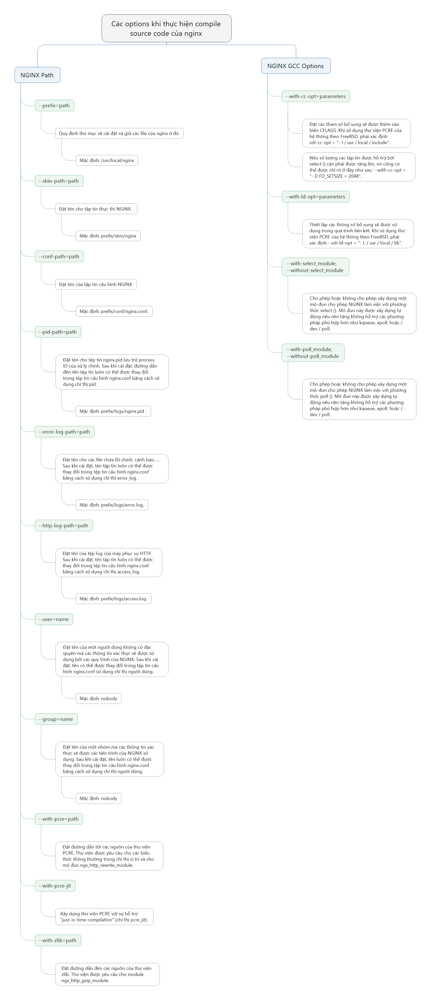

# Tổng hợp các cách cài đặt nginx

# Mục lục

- [Các cách cài đặt nginx](#install)
- [Phân loại module cho nginx và chức năng của các module](#modules)
- [Các options khi cài đặt nginx theo hướng compile](#options)
- [Các nội dung khác](#content-others)

# Nội dung

- #### <a name="install">Các cách cài đặt nginx</a>
	
	

- #### <a name="modules">Phân loại module cho nginx và chức năng của các module</a>

	

- #### <a name="options">Các options khi cài đặt nginx theo hướng compile</a>

	

- # <a name="content-others">Các nội dung khác</a>

	Sẽ cập nhật sau.

	+ 